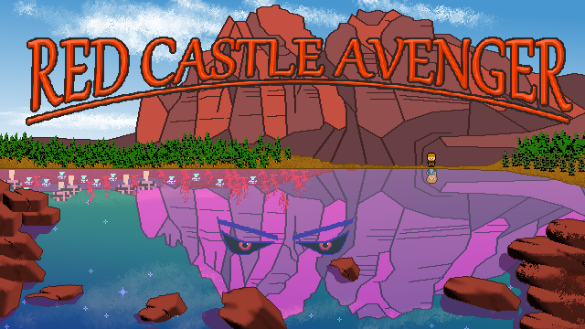

# RCA   - Red Castle Avenger

[redddogjr@gmail.com](mailto:redddogjr@gmail.com) | [License](./LICENSE) | [Credits](./CREDITS) | [Version](./VERSION)



## Story

Larry the blacksmith was just minding his own business. But some idiot just *had* to go get involved in politics! The proud village elder has foolishly drawn the ire of the dragons. That's not a metaphor. Ruoken, the dragon and ursurper king, descends upon the village demanding gold under threat of fire. Had he been consulted, Larry would have just coughed up the dough but the elder wanted to be a hero (fat lot of good that did him). Now the elder is a charred pile of ash.

Larry, who just happened to be standing by, is uselessly offered by the village as a sacrifice.And, while the inferno of the village fades in the distance, Larry is carried in the clutches of the monster towards Red Castle Mountain and almost certain death. 

Or is he? Not without a fight he isnt. Larry's wildly flailing shovel, in hand at the time of his departure from the village, finds a lucky tender point on Ruoken's ironclad scales. It would be incorrect to say that it hurt the dragon but it surprised him enough that he lets go. 

Free falling, Larry supposes that, while he couldn't save his village, he would avenge it if he had just one more chance...

... and this time, fate obliges his desire. Waking up bruised and sore but miraculously unharmed in the meadows of Red Castle valley, Larry takes his first steps on his long journey to become the legendary **Red Castle Avenger!**

## Build from Source
1. Python distribution installed (Python >= 3.10)
1. *Recommended*: Set up a virtual environment in Python to run the build
1. Run the build command from the project's root directory
1. Dependencies should be downloaded, installed and the project built in the project directory
```bash
# set up a virtual environment on Linux
python -m venv build_env
source ./build_env/bin/activate

# set up a virtual environment on Windows
python -m venv build_env
./build_env/Scripts/activate.bat

# build command
python setup.py build
```    


